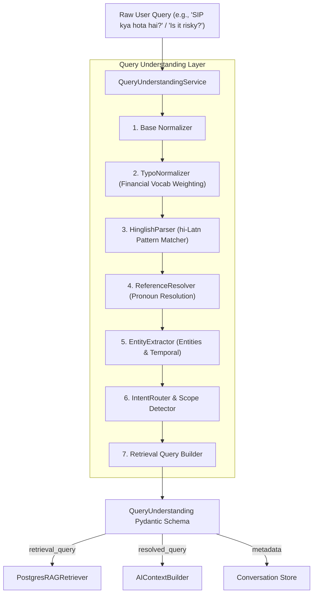

# DhanSarthi — Phase L.1 Query Understanding Layer

## Overview & Core Philosophy

Phase L.1 introduces a deterministic, lightweight, and local **Query Understanding Layer** to DhanSarthi's AI Advisor architecture.

### Architectural Principle
> **UNDERSTAND FIRST → RETRIEVE SECOND → REASON THIRD → ANSWER LAST**

Prior to Phase L.1, incoming user text was directly used for both vector similarity retrieval and LLM context generation. This caused retrieval failures when users typed typos (e.g., `"mutal fund"`), Hinglish phrasing (e.g., `"SIP kya hota hai?"`), or conversational follow-ups (e.g., `"Is it risky?"`).

Phase L.1 inserts a zero-latency query understanding step **BEFORE** retrieval and reasoning take place:
- **No external LLM calls** or network latency added.
- **Original User Question preserved** for display and audit trace.
- **Retrieval Query constructed separately** for pgvector similarity search.
- **Resolved Query created** with explicit pronoun references for LLM prompt context.

---

## Component Architecture



---

## Core Sub-Components

### 1. Typo & Financial Spelling Normalizer (`typo_normalizer.py`)
- Weighting-based correction protecting 20+ financial acronyms (`SIP`, `PPF`, `NPS`, `SGB`, `NAV`, `EMI`, `TDS`, `ITR`, `DTI`, `KYC`, `PAN`, `IPO`, `MF`, `FD`, `RD`, etc.).
- Corrects common typos (`"mutal"` → `"mutual"`, `"invesment"` → `"investment"`, `"savngs"` → `"savings"`, `"emergncy"` → `"emergency"`, `"expence"` → `"expense"`, `"retirment"` → `"retirement"`).
- Unrecognized generic words are preserved without forced generic autocorrection.

### 2. Hinglish & Mixed Language Parser (`hinglish_parser.py`)
- Detects financial Hinglish patterns (`"SIP kya hota hai?"`, `"FD safe hai kya"`, `"mera savings rate kaisa hai"`, `"main SIP me invest karu?"`).
- Normalizes phrases into canonical English forms while setting `language="hi-Latn"` and `detected_language_mix=True`.

### 3. Conversation Reference Resolver (`reference_resolver.py`)
- Resolves ambiguous conversational pronouns (`"it"`, `"this"`, `"that"`, `"this investment"`, `"this fund"`) against recent dialogue history.
- Example:
  - **Turn 1**: *"What is SIP?"*
  - **Turn 2**: *"Is it risky?"* → Resolved: *"Is Systematic Investment Plan risky?"* (`confidence=0.95`).
- If no previous topic can be resolved with high confidence, sets `confidence=0.0` and `resolved_target="UNKNOWN"` without hallucinating false references.

### 4. Entity & Temporal Extractor (`entity_extractor.py`)
- Categorizes entities into `INVESTMENT_PRODUCT`, `FINANCIAL_INSTITUTION`, `TAX_CATEGORY`, `LOAN_TYPE`, `INCOME_CATEGORY`, `EXPENSE_CATEGORY`, `ASSET_TYPE`, `LIABILITY_TYPE`, and `AMOUNT`.
- Identifies temporal expressions (`"this month"`, `"last month"`, `"FY 2025-26"`, `"AY 2026-27"`, `"today"`, `"last 6 months"`) and sets historical markers.

### 5. Query Understanding Service (`service.py`)
- Combines all sub-components into a unified `analyze(query, history)` method producing `QueryUnderstanding`.

---

## Data Models (`backend/app/ai/schemas/query_understanding.py`)

```python
class QueryUnderstanding(BaseModel):
    original_query: str
    normalized_query: str
    corrected_query: str
    resolved_query: str
    retrieval_query: str
    language: str = "en"
    detected_language_mix: bool = False
    intent: QueryIntent
    sub_intent: SubIntent
    entities: List[ExtractedEntity] = Field(default_factory=list)
    financial_terms: List[str] = Field(default_factory=list)
    temporal_references: List[TemporalReference] = Field(default_factory=list)
    conversation_reference: Optional[ConversationReference] = None
    requires_personal_data: bool = False
    requires_rag: bool = False
    requires_market_data: bool = False
    requires_conversation_context: bool = False
    confidence: ConfidenceScores
    correction_applied: bool = False
    hinglish_translated: bool = False
```

---

## Integration Details

1. **`AIAdvisorService` (`backend/app/ai/advisor/service.py`)**:
   - Executes `understanding = self._understanding.analyze(request.message, history=history)` at message entry.
   - Passes `understanding.retrieval_query` to `PostgresRAGRetriever.retrieve()`.
   - Passes `understanding.resolved_query` to `AIContextBuilder.build_context()`.
   - Stores `corrected_query`, `language`, and `correction_applied` in `assistant_metadata`.

2. **`deps.py` (`backend/app/api/deps.py`)**:
   - Registers `get_query_understanding_service()` dependency and injects into `AIAdvisorService`.

---

## Verification & Test Results

### Automated Unit Tests (`backend/tests/ai/test_query_understanding.py`)
- **9/9 Test Suites Passed** in 0.14s:
  - Normal Queries (`"What is SIP?"`, `"What is a mutual fund?"`)
  - Financial Typo Correction (`"mutal"`, `"invesment"`, `"wrk"`, `"expence"`)
  - Hinglish & Mixed Language (`"SIP kya hota hai?"`, `"FD safe hai kya"`)
  - Abbreviation Recognition (`MF`, `FD`, `NAV`, `NPS`, `PPF`)
  - Conversation Reference Resolution (`"Is it risky?"` after `"What is SIP?"`)
  - Personal Finance Data Flags (`"How much did I spend this month?"`)
  - Mixed Queries (`"Is my savings rate healthy?"`)
  - Temporal Expression Extraction (`"last month"`, `"FY 2025-26"`)
  - Ambiguous Queries without History (`"What is it?"` handling low confidence cleanly)

### Full Backend Verification
- **463 backend pytest unit tests passing** (0 failures, 1 skipped).
- Zero regressions across financial engine, RAG, security, and market data modules.

### Frontend Verification
- **0 ESLint errors**.
- **Frontend Vite production build succeeded**.
